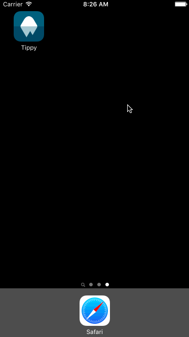

# Tip Calculator

iOS app to calculate a tip and round up the total to a sane number. If the bill was $13.37 and you tip 18%, the total would be $16 instead of $15.78.

Time spent: About 2 hours to get it working and about 15 hours tinkering.

## Completed user stories:

 * [x] Required: User can enter in their bill amount
 * [x] Required: User can calculate a tip based on multiple percentage values
 * [ ] Bill splitting
 * [x] Formatting all the numbers
 * [x] Animations
 * [x] Gestures

## Notes:

It rounds in 50c, $1 and $2 chunks for small bills and $5 and $10 chunks when the bill is big. This makes paying with cash easier and remembering two numbers to write on a receipt easier.

I didn't add splitting because splitting whole numbers is easy and it adds complexity to the UI.

## Walkthrough of all user stories:

GIF created with [LiceCap](http://www.cockos.com/licecap/).
